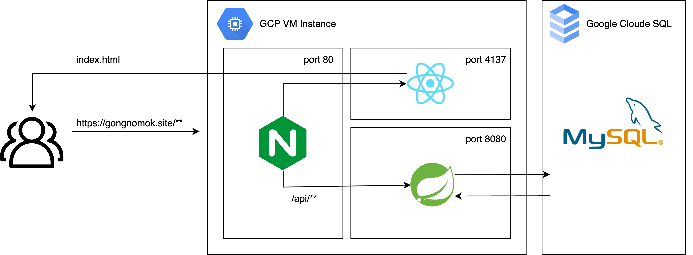

## 메이플 주문서 시뮬레이터

### 프로젝트 소개

메이플 스토리 아이템을 임의로 강화해볼 수 있는 서비스입니다. ([링크](https://gongnomok.site/))

- **개발 기간** `2024.01` ~ `2024.03`
- **플랫폼** `WEB`
- **개발인원** `1명`

- **언어** `JAVA 17`, `Javascript`
- **서버** `Apache Tomcat 10.1.8`, `Nginx 1.18.0`, `GCP VM Instance (Ubuntu)`
- **프레임워크** `Spring Boot 3.2.2`
- **DB** `MySQL 8.0`, `GCP Cloud SQL`

### 프로젝트 구조

### 관련 포스트
- [개발기](https://velog.io/@januaryone/%EB%A9%94%EC%9D%B4%ED%94%8C-%EC%A3%BC%EB%AC%B8%EC%84%9C-%EC%8B%9C%EB%AE%AC%EB%A0%88%EC%9D%B4%ED%84%B0-%EA%B0%9C%EB%B0%9C%EA%B8%B0)